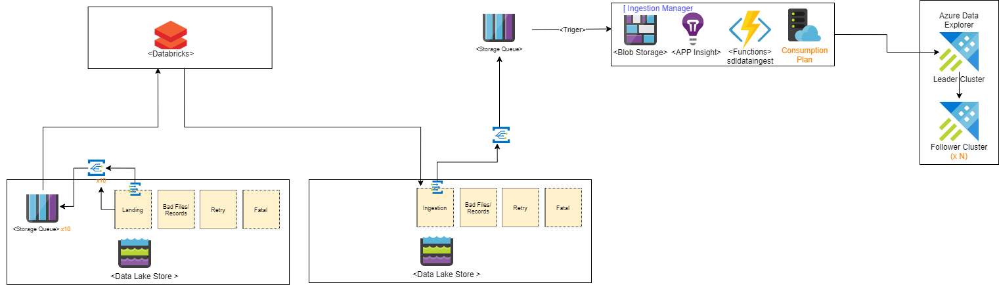

# Data lake storage, Event Grid, Databricks, Functions, and Data Explorer Solution

This folder contains an end-to-end streaming solution sample from data landing into DataLake storage, Databricks autoloader to partition the content and then azure function to ingest data into data explorer. Following you can find the instruction to collaborate by creating this end-to-end samples.


## Flow
1.  Use fake_data_generator.py to generate test data into "landing" data lake storage
2. Databricks Auto Loader process and partition uploaded data by key "companyId" and "type" from "landing" into "ingestion" data lake storage.
3. Eventgrid will be trigger and push message into storage queue
4. Function will be triggered by storage queue and ingest data into Azure data explorer 

## Set up parameters in [config](infra/script/config/provision-config.json)

```json
    "AppName":"Your Application or System Name",
    "ResourceGroupName": "Azure Resource Group Name",
    "Location": "Azure Resource Region",
```
   - "ResourceGroupName" will also be used as a prefix for all resource create so, in order to help to avoid name duplicates that will break the script, you may want to generate a name using a unique prefix. **Please also use only lowercase letters and numbers only**, since the `ResourceGroupName` is also used to create a storage account, which has several constraints on characters usage:
      [Storage Naming Conventions and Limits](https://docs.microsoft.com/en-us/azure/architecture/best-practices/naming-conventions#storage)
   - Location(ex:southeastasia): resource location 
      please use the command below to query all azure locations "Name"

        az account list-locations -o table
## Running the Scripts
Please note that the scripts have been tested on [Ubuntu 18 LTS](http://releases.ubuntu.com/18.04/), so make sure to use that environment to run the scripts. You can run it using Docker, WSL or a VM:

- [Ubuntu Docker Image](https://hub.docker.com/_/ubuntu/)
- [WSL Ubuntu 18.04 LTS](https://www.microsoft.com/en-us/p/ubuntu-1804-lts/9n9tngvndl3q?activetab=pivot:overviewtab)
- [Ubuntu 18.04 LTS Azure VM](https://azuremarketplace.microsoft.com/en-us/marketplace/apps/Canonical.UbuntuServer1804LTS)

The following tools are also needed:

- [Azure CLI](https://docs.microsoft.com/en-us/cli/azure/install-azure-cli-apt?view=azure-cli-latest)
  - Install: `sudo apt install azure-cli`
- [jq](https://stedolan.github.io/jq/download/)
  - Install: `sudo apt install jq`
- python(3.7 or 3.8)
  - Install: `sudo apt install python3.8`
- [databricks-cli](https://github.com/databricks/databricks-cli)
  - Install: `pip install --upgrade databricks-cli`
- [Azure Function Core Tool](https://github.com/Azure/azure-functions-core-tools)
  - Install: `sudo apt-get install azure-functions-core-tools-3`
  
## Setup Solution

Make sure you are logged into your Azure account:

    az login

and also make sure you have the subscription you want to use selected

    az account list

if you want to select a specific subscription use the following command

    az account set --subscription <subscription_name>

once you have selected the subscription you want to use, and also
**confiure the [config](infra/script/config/provision-config.json)**, just execute the following command

    ./create-solution.sh 


to identify configure file path, just run the following command

    ./create-solution.sh -f infra/script/config/provision-config.local.json

to identify configure file path and identify specific steps, just run the following command

    ./create-solution.sh -f infra/script/config/provision-config.local.json -s C

>default steps are: CIDMPFTV
>1. C:common resource including resource group, Data landing and ingestion data lake storage, key vault
>2. I:Ingestion. EventGrid and storage queue
>3. D: Create data explorer and database, tables and data explorer
>4. M: Monitor - Creae log analytics workspace to monitor databricks, function, data explorer, and storage
>5. P:Process - Azure databricks to parition the data by devideId(ex:device-id-1554) and type(ex:CO2)
>6. F:Function - Deploy Azure Function to ingest data into data explorer
>7. T:Test - generate test data
>8. V:Evaluate - evaluate results in data explorer
## Script content

### create-solution.sh

`create-solution.sh` is the script that the end user will execute to deploy the end-to-end solution. Take a look at it and change it to make sure it references the correct file. Section that you're likely to change are delimited with `BEGIN` and `END` comments.

The file does the following things:

* gets and validates the argument from config file
* make sure required software are available
* exports the variables used in called scripts
* execute the requested step by executing the related scripts 

Code should be self-explanatory; if not, just ask.

### source ../components/azure-common/
`create-resource-group.sh`: this script creates resource group
`create-service-principal.sh`: this script creates the service principal used for creating Azure service.
`get-service-principal-data.sh`: this script gets the service principal.

### source ../components/azure-keyvault/
`create-key-vault.sh`: this script creates key vault
`configure-key-vault-access-policy.sh`: this script configure access policy of the key vault
`update-key-vault.sh`: this script updates key vaults value

### source ../components/azure-storage/
`create-storage-hfs.sh`: this script creates a Data lake storage
`create-storage-account.sh`: this script creates a storage account that will be used for function log table
`get-storage-secret-info.sh`: this script gets storage secret info

### ../components/azure-dataexplorer/
`create-dataexplorer.sh`: this scrip creates the data explorer used for store telemetry data. By passing args "-s C", it will only create service without setting up database/tables or eventhub.

### ../components/azure-monitor
`create-log-analytics.sh`: this script creates log analytics workspace
`create-azure-dashboard.sh`: this script creates azure dashboard from template used for monitoring
### ../components/azure-databricks/create-databricks.sh
`create-databricks`: this script creates the databricks used for data partition.

### ../streaming/databricks/
`runners/autoloader-to-datalake.sh`: this script creates a databricks job used for data streaming and partition
`notebooks/autoloader-to-datalake.py`: this is the notebook code that used in databricks job
### ./tools/create-dataexplorer-database
`create_dataexplorer_database.py`: this python code is used to create database and tables in Azure Date Explorer
### ./tools/evaluation
`cleanup_adx_all_db_records.py`:this python code is used to clean up all records in the ADX
`count_adx_all_db_records.py`: this python code is used to count all records in all tables in the ADX
### ./tools/fakedata-generator
`fake_data_generator.py`: this python code is used to generate initial test data to verify if the whole architecture deployed successfully

## Test Data Generation
### 1. Folder structure
- output of fake_data_generator
  {container}/(folder)/{output_time}/{timestamp}.json.gz
		- output_time example: 2020/12/31/00/00

### 2. Usage of fake_data_generator.py
#### 2-1. Generate 1 gz file which contains 10 logs every 3 seconds (throughput is controllable by parameters) until meximal 10 files
```python fake_data_generator.py -fc 1 -c 10 -i 3 -m 10```
#### 2-2. Copy 10 gz files which contains 10 logs every 3 seconds (throughput is controllable by parameters) until meximal 100 files
```python fake_data_generator.py -fc 10 -c 10 -i 3 -m 100```

#### 3. Other args
- ta : target storage account
- tk : target storage key
- tc : tartger container
- tf : target folder inside container

## data schema
- companyid is used for data partition in databricks

```json
{
    "eventId": "b81d241f-5187-40b0-ab2a-940faf9757c0",
    "complexData": {
        "moreData0": 12.12345678901234,
        "moreData1": 12.12345678901234,
        "moreData2": 12.12345678901234,
        "moreData3": 12.12345678901234,
        "moreData4": 12.12345678901234,
        "moreData5": 12.12345678901234,
        "moreData6": 12.12345678901234,
        "moreData7": 12.12345678901234,
        "moreData8": 12.12345678901234,
        "moreData9": 12.12345678901234,
        "moreData10": 12.12345678901234,
        "moreData11": 12.12345678901234,
        "moreData12": 12.12345678901234,
        "moreData13": 12.12345678901234,
        "moreData14": 12.12345678901234,
        "moreData15": 12.12345678901234,
        "moreData16": 12.12345678901234,
        "moreData17": 12.12345678901234,
        "moreData18": 12.12345678901234,
        "moreData19": 12.12345678901234,
        "moreData20": 12.12345678901234,
        "moreData21": 12.12345678901234,
        "moreData22": 12.12345678901234
    },
    "value": 49.02278128887753,
	"deviceId": "contoso://device-id-1554",
	"companyId": "company-id-6",
  "deviceSequenceNumber": 0,
  "type": "CO2",
  "createdAt": "2019-05-16T17:16:40.000003Z"
}
```

and it will send data to the specified data lake and trigger eventgrid.

## Created resources
  - **azure-key-vault** : One for storing secret pairs that will be used in deployment
  - **azure-data-lake-storage** : One for data landing and one for data ingestion
  - **azure-data-storage** : One for log table
  - **azure-event-grid** : One for data land into storage, eventgrid will send the message to storage queue, One data land into storage, eventgrid will send the message to storage queue
  - **azure-storage-queue** : one for Databricks autoloader, one for Azure function input
  - **azure-functions** : parse metadata and ingestion data into dataexplorer queue
  - **azure-databricks** : partition data by companyid and type
  - **azure-data-explorer** : store and serve processed data