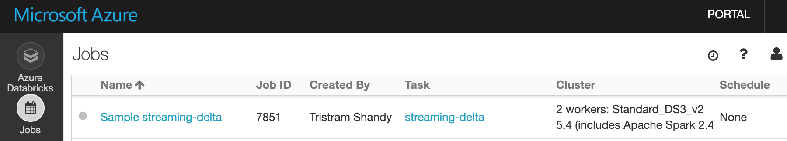

# Streaming at Scale with Azure Storage, Databricks and Delta Lake

This sample uses Azure Databricks to ingest data from Azure Storage blobs and store data into [Delta Lake](https://docs.azuredatabricks.net/delta/index.html) storage.

To generate simulated ingestion data, the sample deploys data simulator Container Instances, an Event Hubs instance to receive the data from the simulator configured with Event Hubs Capture to write the data in blobs to be processed by Databricks.

The provided scripts will deploy an end-to-end solution complete with load test client.

## Running the Scripts

Please note that the scripts have been tested on [Ubuntu 18 LTS](http://releases.ubuntu.com/18.04/), so make sure to use that environment to run the scripts. You can run it using Docker, WSL or a VM:

- [Ubuntu Docker Image](https://hub.docker.com/_/ubuntu/)
- [WSL Ubuntu 18.04 LTS](https://www.microsoft.com/en-us/p/ubuntu-1804-lts/9n9tngvndl3q?activetab=pivot:overviewtab)
- [Ubuntu 18.04 LTS Azure VM](https://azuremarketplace.microsoft.com/en-us/marketplace/apps/Canonical.UbuntuServer1804LTS)

The following tools/languages are also needed:

- [Azure CLI](https://docs.microsoft.com/en-us/cli/azure/install-azure-cli-apt?view=azure-cli-latest)
  - Install: `sudo apt install azure-cli`
- [jq](https://stedolan.github.io/jq/download/)
  - Install: `sudo apt install jq`
- [python]
  - Install: `sudo apt install python python-pip`
- [databricks-cli](https://docs.azuredatabricks.net/user-guide/dev-tools/databricks-cli.html#install-the-cli)
  - Install: `pip install --upgrade databricks-cli`

## Setup Solution

Make sure you are logged into your Azure account:

    az login

and also make sure you have the subscription you want to use selected

    az account list

if you want to select a specific subscription use the following command

    az account set --subscription <subscription_name>

once you have selected the subscription you want to use just execute the following command

    ./create-solution.sh -d <solution_name>

then `solution_name` value will be used to create a resource group that will contain all resources created by the script. It will also be used as a prefix for all resource create so, in order to help to avoid name duplicates that will break the script, you may want to generate a name using a unique prefix. **Please also use only lowercase letters and numbers only**, since the `solution_name` is also used to create a storage account, which has several constraints on characters usage:

[Storage Naming Conventions and Limits](https://docs.microsoft.com/en-us/azure/architecture/best-practices/naming-conventions#storage)

to have an overview of all the supported arguments just run

    ./create-solution.sh

**Note**
To make sure that name collisions will be unlikely, you should use a random string to give name to your solution. The following script will generated a 7 random lowercase letter name for you:

    ./_common/generate-solution-name.sh

## Created resources

The script will create the following resources:

- **Azure Container Instances** to host Spark Load Test Clients: by default one client will be created, generating a load of 1000 events/second
- **Event Hubs** Namespace, Hub and Consumer Group: to ingest data incoming from test clients
- **Azure Storage** (Data Lake Storage Gen2): to store event data as blobs
- **Azure Databricks**: to process data incoming from Azure Storage as a stream, and store it using Delta Lake. An Azure databricks Workspace and Job will be created, and the job will be run for 30 minutes on a transient cluster.

## Streamed Data

Streamed data simulates an IoT device sending the following JSON data:

```json
{
    "eventId": "b81d241f-5187-40b0-ab2a-940faf9757c0",
    "complexData": {
        "moreData0": 57.739726013343247,
        "moreData1": 52.230732688620829,
        "moreData2": 57.497518587807189,
        "moreData3": 81.32211656749469,
        "moreData4": 54.412361539409427,
        "moreData5": 75.36416309399911,
        "moreData6": 71.53407865773488,
        "moreData7": 45.34076957651598,
        "moreData8": 51.3068118685458,
        "moreData9": 44.44672606436184,
        [...]
    },
    "value": 49.02278128887753,
    "deviceId": "contoso-device-id-000154",
    "deviceSequenceNumber": 0,
    "type": "CO2",
    "createdAt": "2019-05-16T17:16:40.000003Z"
}
```

## Duplicate event handling

The solution currently does not perform event deduplication. In order to illustrate the effect of this, the event simulator is configured to randomly duplicate a small fraction of the messages (0.1% on average). Those duplicate events will be present in Delta.

## Solution customization

If you want to change some setting of the solution, like number of load test clients, Databricks workers and so on, you can do it right in the `create-solution.sh` script, by changing any of these values:

    export EVENTHUB_PARTITIONS=2
    export EVENTHUB_CAPACITY=2
    export SIMULATOR_INSTANCES=1
    export DATABRICKS_NODETYPE=Standard_DS3_v2
    export DATABRICKS_WORKERS=2
    export DATABRICKS_MAXEVENTSPERTRIGGER=7000

The above settings have been chosen to sustain a 1,000 msg/s stream. The script also contains settings for 5,000 msg/s and 10,000 msg/s.

## Monitor performance

Performance will be monitored and displayed on the console for 30 minutes. More specifically Input performance of Event Hub will be monitored. Because Event Hubs Capture is used (rather than event consumers), the outgoing metrics are empty.

```text
***** [M] Starting METRICS reporting
Reporting aggregate metrics per minute, offset by 2 minutes, for 30 minutes.
Event Hub #1 Namespace: streamingatscale
Event Hub capacity: 2 throughput units (this determines MAX VALUE below).
                             Event Hub #    IncomingMessages       IncomingBytes    OutgoingMessages       OutgoingBytes   ThrottledRequests
                             -----------    ----------------       -------------    ----------------       -------------  ------------------
                   MAX VALUE Event Hub 1              120000           120000000              491520           240000000                   -
                             -----------    ----------------       -------------    ----------------       -------------  ------------------
    2021-06-28T18:49:28+0200 Event Hub 1               60163            56077016                   0                   0                   0
    2021-06-28T18:50:05+0200 Event Hub 1               60218            56127927                   0                   0                   0
    2021-06-28T18:51:05+0200 Event Hub 1               60096            56015228                   0                   0                   0
```

## Azure Databricks

The solution allows you to test two modes for the [Databricks Auto Loader](https://docs.microsoft.com/en-us/azure/databricks/spark/latest/structured-streaming/auto-loader) to detect new files:
- `notification` using a storage queue populated by Event Grid
- `listing` using periodic listing of the input directory

Use the `-b` option and set it to `notification` or `listing` to run the solution against the table you are interested in testing.

The deployed Azure Databricks workspace contains a notebook stored under `Shared/streaming_at_scale`. If you plan to modify the notebook, first copy it to another location, as it will be overwritten if you run the solution again.

The solution runs a Databricks stream processing job for 30 minutes only. To sustain a stream processing job, consult the documentation on [Structured Streaming in Production](https://docs.azuredatabricks.net/spark/latest/structured-streaming/production.html).

You can log into the workspace and view the executed job by navigating to the Jobs pane:



After clicking on the job, you can navigate to the run and view the executed notebook. By expanding the output of the `writeStream` cell, you can see statistics about stream processing.


## Query Data

Data is stored in a Delta Lake Spark table in the created Azure Databricks workspace, backed by Azure Data Lake Storage Gen2. You can query the table by logging  into the Databricks workspace, creating a cluster, and creating a notebook to query the data.
From a Databricks notebook, connect spark to the Azure Datalake Gen2 storage:

```scala
val gen2account = "<created-adls2-storage-account>"
spark.conf.set(s"fs.azure.account.key.$gen2account.dfs.core.windows.net", "<created-adls2-storage-key>")
dbutils.fs.ls(s"abfss://streamingatscale@$gen2account.dfs.core.windows.net/")
```

and the you can query the table using Spark SQL for example:

```
%sql
SELECT * FROM delta.`abfss://streamingatscale@<created-adls2-storage-account>.dfs.core.windows.net/events` LIMIT 100
```

More info here:

[Delta Lake Quickstart - Read a Table](https://docs.azuredatabricks.net/delta/quick-start.html#read-a-table)

## Clean up

To remove all the created resource, you can just delete the related resource group

```bash
az group delete -n <resource-group-name>
```
