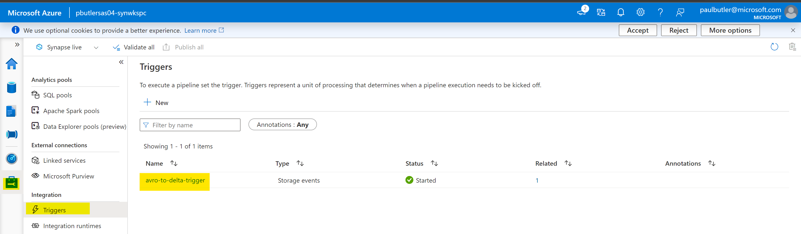
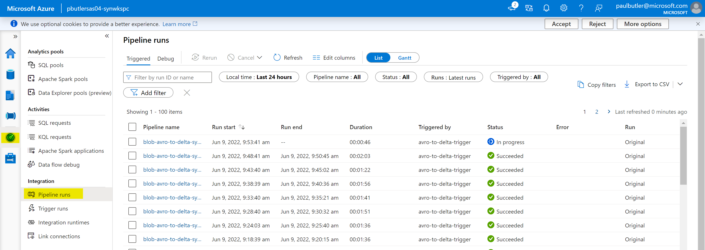
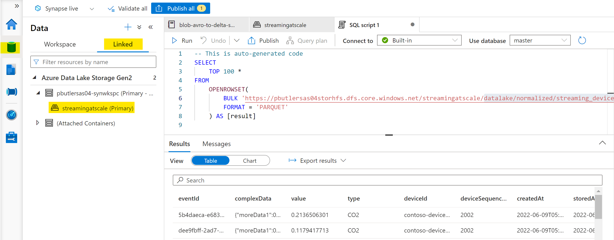

# Streaming at Scale with Azure Storage, Synapse and Delta Lake

This sample uses Azure Synapse to ingest EventHub-captured blobs into Azure Storage [Delta Lake](https://docs.azuredatabricks.net/delta/index.html) storage.

Azure Container Instances generates sample data into Event hub which are then saved in Azure Blob Storage using [Event Hub Capture](https://docs.microsoft.com/en-us/azure/event-hubs/event-hubs-capture-overview). A blob landing in the designated container triggers a Synapse pipeline which processes and stores it in a Delta table.
The provided scripts will deploy an end-to-end solution complete with load test client.

## Running the Scripts

Please note that the scripts have been tested on [Ubuntu 18 LTS](http://releases.ubuntu.com/18.04/), so make sure to use that environment to run the scripts. You can run it using Docker, WSL or a VM:

- [Ubuntu Docker Image](https://hub.docker.com/_/ubuntu/)
- [WSL Ubuntu 18.04 LTS](https://www.microsoft.com/en-us/p/ubuntu-1804-lts/9n9tngvndl3q?activetab=pivot:overviewtab)
- [Ubuntu 18.04 LTS Azure VM](https://azuremarketplace.microsoft.com/en-us/marketplace/apps/Canonical.UbuntuServer1804LTS)

The following tools/languages are also needed:

- [Azure CLI](https://docs.microsoft.com/en-us/cli/azure/install-azure-cli-apt?view=azure-cli-latest)
  - Install: `sudo apt install azure-cli`
- [jq](https://stedolan.github.io/jq/download/)
  - Install: `sudo apt install jq`
- [python](https://www.python.org/)
  - Install: `sudo apt install python python-pip`

## Setup Solution

Make sure you are logged into your Azure account:

    az login

and also make sure you have the subscription you want to use selected

    az account list

if you want to select a specific subscription use the following command

    az account set --subscription <subscription_name>

once you have selected the subscription you want to use just execute the following command

    ./create-solution.sh -d <solution_name> -p <synapse_sql_password> -w <wait_verfication>

- The `solution_name` value is used to create a resource group that contains all resources created by the script. It is also be used as a prefix for all resource create so, in order to help to avoid name duplicates that will break the script, you may want to generate a name using a unique prefix. **Please also use only lowercase letters and numbers only**, since the `solution_name` is also used to create a storage account, which has several constraints on characters usage:

[Storage Naming Conventions and Limits](https://docs.microsoft.com/en-us/azure/architecture/best-practices/naming-conventions#storage)

- The `sql-admin-login-password` value is be used to create the password for the synapse sql pool. The SQL Pools are not explicitly used anywhere in the project, but the SQL Admin Login Password is necessary when creating a Synapse Workspace.

> [Refer to Azure SQL Password Policy and Complexity](https://docs.microsoft.com/en-us/sql/relational-databases/security/password-policy?view=sql-server-ver16#password-complexity)

- `wait_verification` is a boolean flag defaulted to `true` that places the CLI in a waiting state until the pipeline results have been downloaded and written to SDTOUT.

To have an overview of all the supported arguments just run

    ./create-solution.sh

**Note**
To make sure that name collisions will be unlikely, you should use a random string to give name to your solution. The following script will generated a 7 random lowercase letter name for you:

    ./_common/generate-solution-name.sh

## Created resources

The script will create the following resources:

- **Azure Container Instances** to host Spark Load Test Clients: by default one client will be created, generating a load of 1000 events/second
- **Event Hubs** Namespace, Hub and Consumer Group: to ingest data incoming from test clients
- **Azure Storage** (Data Lake Storage Gen2): to store event data as blobs
- **Azure Synapse**: to process data incoming from Azure Storage as a stream using a blob triggered pipeline, and store it using Delta Lake. An Azure Synapse Workspace and Job will be created, and the job will be run on blob create, and will read all the data from the last checkpoint.

## Streamed Data

Streamed data simulates an IoT device sending the following JSON data:

```json
{
    "eventId": "b81d241f-5187-40b0-ab2a-940faf9757c0",
    "complexData": {
        "moreData0": 57.739726013343247,
        "moreData1": 52.230732688620829,
        "moreData2": 57.497518587807189,
        "moreData3": 81.32211656749469,
        "moreData4": 54.412361539409427,
        "moreData5": 75.36416309399911,
        "moreData6": 71.53407865773488,
        "moreData7": 45.34076957651598,
        "moreData8": 51.3068118685458,
        "moreData9": 44.44672606436184,
        [...]
    },
    "value": 49.02278128887753,
    "deviceId": "contoso-device-id-000154",
    "deviceSequenceNumber": 0,
    "type": "CO2",
    "createdAt": "2019-05-16T17:16:40.000003Z"
}
```

## Duplicate event handling

The solution currently does not perform event deduplication. In order to illustrate the effect of this, the event simulator is configured to randomly duplicate a small fraction of the messages (0.1% on average). Those duplicate events will be present in Delta.

## Solution customization

If you want to change some setting of the solution, like number of load test clients, Synapse Spark Pool workers and so on, you can do it right in the `create-solution.sh` script, by changing any of these values:

    export EVENTHUB_PARTITIONS=2
    export EVENTHUB_CAPACITY=2
    export SIMULATOR_INSTANCES=1

The above settings have been chosen to sustain a 1,000 msg/s stream. The script also contains settings for 5,000 msg/s and 10,000 msg/s.

## Monitor performance

Performance will be monitored and displayed on the console for 30 minutes. More specifically Input performance of Event Hub will be monitored. Because Event Hubs Capture is used (rather than event consumers), the outgoing metrics are empty.

```text
***** [M] Starting METRICS reporting
Reporting aggregate metrics per minute, offset by 2 minutes, for 30 minutes.
Event Hub #1 Namespace: streamingatscale
Event Hub capacity: 2 throughput units (this determines MAX VALUE below).
                             Event Hub #    IncomingMessages       IncomingBytes    OutgoingMessages       OutgoingBytes   ThrottledRequests
                             -----------    ----------------       -------------    ----------------       -------------  ------------------
                   MAX VALUE Event Hub 1              120000           120000000              491520           240000000                   -
                             -----------    ----------------       -------------    ----------------       -------------  ------------------
    2021-06-28T18:49:28+0200 Event Hub 1               60163            56077016                   0                   0                   0
    2021-06-28T18:50:05+0200 Event Hub 1               60218            56127927                   0                   0                   0
    2021-06-28T18:51:05+0200 Event Hub 1               60096            56015228                   0                   0                   0
```

## Azure Synapse

The solution uses [Storage Event Trigger](https://docs.microsoft.com/en-us/azure/data-factory/how-to-create-event-trigger?tabs=data-factory) to detect and load new files, using a storage queue populated by Event Grid. While this url links to a Data Factory example, there is Synapse specific information within this documentation.

The `Storage Event Trigger` is a type of trigger. To view more details on the trigger, go to the synapse workspace and click on then manage tab. In the manage tab, click on Triggers under Integration. You will see a trigger named `avro-to-delta-trigger`.



The deployed Azure Synapse workspace contains a notebook stored under the Develop tab as `blob-avro-to-delta-synapse`. If you plan to modify the notebook, first copy it to another location, as it will be overwritten if you run the solution again.

Synapse doesn't natively support an always up cluster. This approach is one way to get out of the box checkpointing with an append only store and EventHub capture. For more complex streaming requirements (data landing more frequently or slow changing data), it is advised to use a more robust design.

You can log into the workspace and view the executed pipeline (which runs the notebook) by navigating to the Monitor tab in the provisioned Synapse Workspace:



After clicking on the pipeline run, you can navigate to the run and view the executed pipeline. From there, you can view the run of the notebook.

## Query Data

Data is stored in a Delta Lake Spark table in the created Azure Synapse workspace, backed by Azure Data Lake Storage Gen2. You can query the table by logging into the Synapse workspace, by navigating to the normalized output path `datalake/normalized/streaming_device` in the Data tab (under the Linked section) of your Synapse workspace.

**NOTE**: You will need to have the `Storage Data Blob Contributor` role assigned to query the data from your Synapse Workspace.

After right clicking on either the folder (`datalake/normalized/streaming_device`) or a specific file in the normalized data folder, you will be given the option to use SQL to query the data. It is advised to select `New SQL Script > Select Top 100 Rows`. If you right clicked on the folder, you will need to read the data as `DELTA`. If you right clicked on a specific file, you will need to read the data as `PARQUET`. You should now see a new screen querying the desired source. Run the query to see the results.



## Clean up

To remove all the created resource, you can just delete the related resource group

```bash
az group delete -n <resource-group-name>
```
