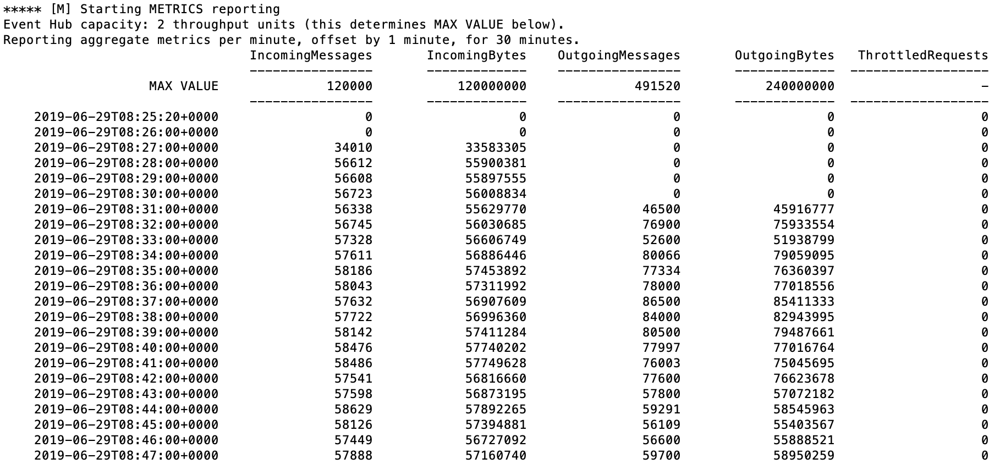

# Streaming at Scale with Azure Event Hubs, Databricks and Delta Lake

This sample uses Azure Databricks to process and store data into [Delta Lake](https://docs.azuredatabricks.net/delta/index.html) storage.

The provided scripts will deploy an end-to-end solution complete with load test client.

## Running the Scripts

Please note that the scripts have been tested on [Ubuntu 18 LTS](http://releases.ubuntu.com/18.04/), so make sure to use that environment to run the scripts. You can run it using Docker, WSL or a VM:

- [Ubuntu Docker Image](https://hub.docker.com/_/ubuntu/)
- [WSL Ubuntu 18.04 LTS](https://www.microsoft.com/en-us/p/ubuntu-1804-lts/9n9tngvndl3q?activetab=pivot:overviewtab)
- [Ubuntu 18.04 LTS Azure VM](https://azuremarketplace.microsoft.com/en-us/marketplace/apps/Canonical.UbuntuServer1804LTS)

The following tools/languages are also needed:

- [Azure CLI](https://docs.microsoft.com/en-us/cli/azure/install-azure-cli-apt?view=azure-cli-latest)
  - Install: `sudo apt install azure-cli`
- [jq](https://stedolan.github.io/jq/download/)
  - Install: `sudo apt install jq`
- [python]
  - Install: `sudo apt install python python-pip`
- [databricks-cli](https://docs.azuredatabricks.net/user-guide/dev-tools/databricks-cli.html#install-the-cli)
  - Install: `pip install --upgrade databricks-cli`

## Setup Solution

Make sure you are logged into your Azure account:

    az login

and also make sure you have the subscription you want to use selected

    az account list

if you want to select a specific subscription use the following command

    az account set --subscription <subscription_name>

once you have selected the subscription you want to use just execute the following command

    ./create-solution.sh -d <solution_name>

then `solution_name` value will be used to create a resource group that will contain all resources created by the script. It will also be used as a prefix for all resource create so, in order to help to avoid name duplicates that will break the script, you may want to generate a name using a unique prefix. **Please also use only lowercase letters and numbers only**, since the `solution_name` is also used to create a storage account, which has several constraints on characters usage:

[Storage Naming Conventions and Limits](https://docs.microsoft.com/en-us/azure/architecture/best-practices/naming-conventions#storage)

to have an overview of all the supported arguments just run

    ./create-solution.sh

**Note**
To make sure that name collisions will be unlikely, you should use a random string to give name to your solution. The following script will generated a 7 random lowercase letter name for you:

    ./_common/generate-solution-name.sh

## Created resources

The script will create the following resources:

- **Azure Container Instances** to host Spark Load Test Clients: by default one client will be created, generating a load of 1000 events/second
- **Event Hubs** Namespace, Hub and Consumer Group: to ingest data incoming from test clients
- **Azure Databricks**: to process data incoming from Event Hubs as a stream, and store it using Delta Lake. An Azure databricks Workspace and Job will be created, and the job will be run for 30 minutes on a transient cluster.

## Streamed Data

Streamed data simulates an IoT device sending the following JSON data:

```json
{
    "eventId": "b81d241f-5187-40b0-ab2a-940faf9757c0",
    "complexData": {
        "moreData0": 57.739726013343247,
        "moreData1": 52.230732688620829,
        "moreData2": 57.497518587807189,
        "moreData3": 81.32211656749469,
        "moreData4": 54.412361539409427,
        "moreData5": 75.36416309399911,
        "moreData6": 71.53407865773488,
        "moreData7": 45.34076957651598,
        "moreData8": 51.3068118685458,
        "moreData9": 44.44672606436184,
        [...]
    },
    "value": 49.02278128887753,
    "deviceId": "contoso://device-id-154",
    "type": "CO2",
    "createdAt": "2019-05-16T17:16:40.000003Z"
}
```

## Solution customization

If you want to change some setting of the solution, like number of load test clients, Databricks workers and so on, you can do it right in the `create-solution.sh` script, by changing any of these values:

    export EVENTHUB_PARTITIONS=2
    export EVENTHUB_CAPACITY=2
    export SIMULATOR_INSTANCES=1
    export DATABRICKS_NODETYPE=Standard_DS3_v2
    export DATABRICKS_WORKERS=2
    export DATABRICKS_MAXEVENTSPERTRIGGER=7000

The above settings has been chosen to sustain a 1,000 msg/s stream. The script also contains settings for 5,000 msg/s and 10,000 msg/s.

## Monitor performance

Performance will be monitored and displayed on the console for 30 minutes. More specifically Inputs and Outputs performance of Event Hub will be monitored.

The test clients start sending messages before the Databricks job is active, and those messages accumulate into Event Hubs for a few minutes. Then, the Databricks job starts consuming the backlog (here starting at 08:31). After a few minutes of this ramp-up, the number of reported `IncomingMessages` and `OutgoingMessages` should be roughly the same at around 60,000 messages per minute (here starting around 08:44).



## Azure Databricks

The deployed Azure Databricks workspace contains a notebook stored under `Shared/streaming_at_scale`. If you plan to modify the notebook, first copy it to another location, as it will be overwritten if you run the solution again.

The solution runs a Databricks stream processing job for 30 minutes only. To sustain a stream processing job, consult the documentation on [Structured Streaming in Production](https://docs.azuredatabricks.net/spark/latest/structured-streaming/production.html).

You can log into the workspace and view the executed job by navigating to the Jobs pane:


After clicking on the job, you can navigate to the run and view the executed notebook. By expanding the output of the `writeStream` cell, you can see statistics about stream processing.


## Optimizing the Structured Streaming job

A good starting point for cluster configuration is to have the number of workers equal the number of Event Hubs partitions, so that all workers participate in consuming data from Event Hubs.

The limiting factor for throughput is not consuming from Event Hubs, but writing data to Delta Lake (Parquet columnar compressed data). To increase throughput if needed, you can leverage the following settings:

- Having additional worker nodes, to parallelize the writing across additional processes. Note that columnar data compression gains quickly level off, and that this will result in smaller files in Delta Lake storage.
- Increasing the maxEventsPerTrigger setting, i.e. number of events processed per Structured Streaming micro-batch, at the cost of addittional latency.

Here are some measures of maximum processing rate (events/second) observed using Databricks Runtime 5.4 and Standard\_DS3\_v2 worker nodes (Event Hubs configured with 2 partitions and 2 throughput units):

| maxEventsPerTrigger (columns) & worker nodes (rows)       | 3000 | 4000 | 5000 | 6000 | 7000 |
|--------------------|------|------|------|------|------|
| **1**              | 525  |  700 |  918 | 1090 | 1168 |
| **2**              | 700  |  898 | 1067 | 1250 | 1442 |
| **3**              | 773  | 1000 | 1250 | 1406 | 1632 |
| **4**              | 800  | 1067 | 1375 | 1502 | 1632 |


Accordingly, in the standard solution we defined 2 worker nodes and DATABRICKS_MAXEVENTSPERTRIGGER=7000 to ensure a max ingestion rate over 40% higher than the average incoming throughput, in order to account for spikes, node failures, etc.

## Query Data

Data is stored in a Delta Lake Spark table in the created Azure Databricks workspace, backed by Azure Data Lake Storage Gen2. You can query the table by logging  into the Databricks workspace, creating a cluster, and creating a notebook to query the data.
From a Databricks notebook, connect spark to the Azure Datalake Gen2 storage:

```scala
val gen2account = "<created-adsl2-storage-account>"
spark.conf.set(s"fs.azure.account.key.$gen2account.dfs.core.windows.net", "<created-adsl2-storage-key>")
dbutils.fs.ls(s"abfss://streamingatscale@$gen2account.dfs.core.windows.net/")
```

and the you can query the table using Spark SQL for example:

```
%sql
SELECT * FROM delta.`abfss://streamingatscale@<created-adsl2-storage-account>.dfs.core.windows.net/events` LIMIT 100
```

More info here:

[Delta Lake Quickstart - Read a Table](https://docs.azuredatabricks.net/delta/quick-start.html#read-a-table)

## Clean up

To remove all the created resource, you can just delete the related resource group

```bash
az group delete -n <resource-group-name>
```
