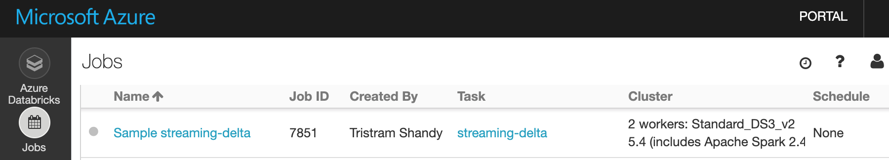
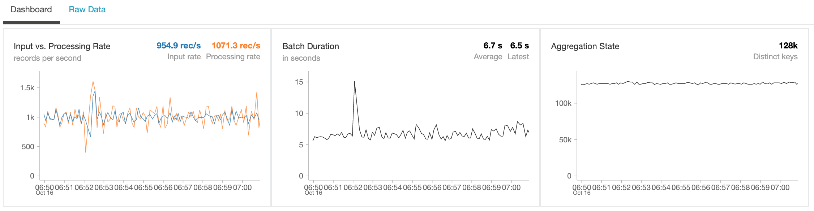
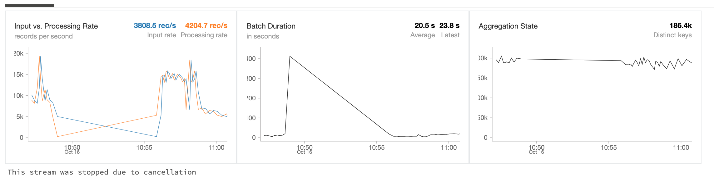

# Streaming at Scale with Azure Event Hubs and Databricks

This sample uses Databricks to process streaming data from EventHub and uses another Event Hub as a sink to store JSON data. Minimal processing is done on the data, only deduplication and no aggregation. The data is passed as fast as possible from the input to the output. Data is augmented by adding additional fields.

To support very high throughput, two different Event Hubs namespaces are deployed by the template. Event Hubs capacity is limited to up to 20 units of 1 MB/s each (although this limit can be increased through a support ticket). If incoming throughput is under 10 MB/s, you could deploy two Event Hub instances under a single namespace instead.

The provided scripts will create an end-to-end solution complete with load test client.

## Running the Scripts

Please note that the scripts have been tested on [Ubuntu 18 LTS](http://releases.ubuntu.com/18.04/), so make sure to use that environment to run the scripts. You can run it using Docker, WSL or a VM:

- [Ubuntu Docker Image](https://hub.docker.com/_/ubuntu/)
- [WSL Ubuntu 18.04 LTS](https://www.microsoft.com/en-us/p/ubuntu-1804-lts/9n9tngvndl3q?activetab=pivot:overviewtab)
- [Ubuntu 18.04 LTS Azure VM](https://azuremarketplace.microsoft.com/en-us/marketplace/apps/Canonical.UbuntuServer1804LTS)

The following tools/languages are also needed:

- [Azure CLI](https://docs.microsoft.com/en-us/cli/azure/install-azure-cli-apt?view=azure-cli-latest)
  - Install: `sudo apt install azure-cli`
- [jq](https://stedolan.github.io/jq/download/)
  - Install: `sudo apt install jq`
- [python](https://www.python.org/)
  - Install: `sudo apt install python python-pip`
- [databricks-cli](https://github.com/databricks/databricks-cli)
  - Install: `pip install --upgrade databricks-cli`

## Setup Solution

Make sure you are logged into your Azure account:

    az login

and also make sure you have the subscription you want to use selected

    az account list

if you want to select a specific subscription use the following command

    az account set --subscription <subscription_name>

once you have selected the subscription you want to use just execute the following command

    ./create-solution.sh -d <solution_name>

then `solution_name` value will be used to create a resource group that will contain all resources created by the script. It will also be used as a prefix for all resource create so, in order to help to avoid name duplicates that will break the script, you may want to generate a name using a unique prefix. **Please also use only lowercase letters and numbers only**, since the `solution_name` is also used to create a storage account, which has several constraints on characters usage:

[Storage Naming Conventions and Limits](https://docs.microsoft.com/en-us/azure/architecture/best-practices/naming-conventions#storage)

to have an overview of all the supported arguments just run

    ./create-solution.sh

**Note**
To make sure that name collisions will be unlikely, you should use a random string to give name to your solution. The following script will generated a 7 random lowercase letter name for you:

    ./_common/generate-solution-name.sh

## Created resources

The script will create the following resources:

- **Azure Container Instances** to host Spark Load Test Clients: by default one client will be created, generating a load of 1000 events/second
- **Event Hubs** Namespace, Hub and Consumer Group: to ingest data incoming from test clients and to store data generated by Databricks
- **Azure Databricks**: to process data incoming from Event Hubs as a stream. Workspace, Job and related cluster will be created

## Streamed Data

Streamed data simulates an IoT device sending the following JSON data:

```json
{
    "eventId": "b81d241f-5187-40b0-ab2a-940faf9757c0",
    "complexData": {
        "moreData0": 57.739726013343247,
        "moreData1": 52.230732688620829,
        "moreData2": 57.497518587807189,
        "moreData3": 81.32211656749469,
        "moreData4": 54.412361539409427,
        "moreData5": 75.36416309399911,
        "moreData6": 71.53407865773488,
        "moreData7": 45.34076957651598,
        "moreData8": 51.3068118685458,
        "moreData9": 44.44672606436184,
        [...]
    },
    "value": 49.02278128887753,
    "deviceId": "contoso://device-id-154",
    "deviceSequenceNumber": 0,
    "type": "CO2",
    "createdAt": "2019-05-16T17:16:40.000003Z"
}
```

## Duplicate event handling

In case the Databricks job fails and recovers, it could process a second time an event from Event Hubs that has already been stored in the destination Event Hubs. The solution uses the Spark Structured Streaming dropDuplicates operator to keep track of already processed events, with a watermark of 10 seconds. As a result, any data received too late data (older than the watermark) is dropped to avoid any possibility of duplicates.

In order to illustrate the effect of this, the event simulator is configured to randomly duplicate a small fraction of the messages (0.1% on average). Those duplicate events are not stored in the destination Event Hubs.

Note that this method is not failsafe, as the streaming job could send an event to the destination Event Hubs but fail to receive the acknowledgement that the event was stored, and send it a second time. It is preferrable to design the downstream component of the solution to tolerate duplicate data.

## End-to-end latency

As of Spark 2.4, introducing any windowed stream processing (such as dropDuplicates above) causes the latency to sharply increase, in some tests from around 1 second to around 8 seconds.

## Solution customization

If you want to change some setting of the solution, like number of load test clients, Cosmos DB RU and so on, you can do it right in the `create-solution.sh` script, by changing any of these values:
XXX

    export EVENTHUB_PARTITIONS=2
    export EVENTHUB_CAPACITY=2
    export SIMULATOR_INSTANCES=1
    export DATABRICKS_NODETYPE=Standard_DS3_v2
    export DATABRICKS_WORKERS=2
    export DATABRICKS_MAXEVENTSPERTRIGGER=10000

The above settings have been chosen to sustain a 1,000 msg/s stream. The script also contains settings for 5,000 msg/s and 10,000 msg/s.

## Monitor performance

In order to monitor performance of created solution you just have to open the created Application Insight resource and then open the "Live Metric Streams" and you'll be able to see in the "incoming request" the number of processed request per second. The number you'll see here is very likely to be lower than the number of messages/second sent by test clients since the Azure Function is configured to use batching".


The deployment script will also report performance, by default every minute for 30 minutes:

```
***** [M] Starting METRICS reporting
Event Hub capacity: 2 throughput units (this determines MAX VALUE below).
Reporting aggregate metrics per minute, offset by 2 minutes, for 30 minutes.
                        Event Hub #  IncomingMessages  IncomingBytes  OutgoingMessages  OutgoingBytes  ThrottledRequests
                        -----------  ----------------  -------------  ----------------  -------------  -----------------
              MAX VALUE                        120000      120000000            491520      240000000                  -
                        -----------  ----------------  -------------  ----------------  -------------  -----------------
    2019-10-15T19:40:00           1                 0              0                 0              0                  0
    2019-10-15T19:40:00           2                 0              0                 0              0                  0
    2019-10-15T19:41:00           1             23056       22459305                 0              0                  0
    2019-10-15T19:41:00           2                 0              0                 0              0                  0
    2019-10-15T19:42:00           1             61648       60068631             15800       15389332                  0
    2019-10-15T19:42:00           2              4996        5018442                 0              0                  0
    2019-10-15T19:43:00           1             59964       58474044             60700       59142604                  0
    2019-10-15T19:43:00           2             55294       55594439                 0              0                  0
    2019-10-15T19:44:00           1             60038       58562417             79400       77425871                  0
    2019-10-15T19:44:00           2             78971       79447252                 0              0                  0
    2019-10-15T19:45:00           1             60143       58664551             85700       83593972                  0
    2019-10-15T19:45:00           2             82747       83287964                 0              0                  0
    2019-10-15T19:46:00           1             60248       58768160             76700       74815109                  0
    2019-10-15T19:46:00           2             82665       83205954                 0              0                  0
    2019-10-15T19:47:00           1             59797       58326873             61400       59890846                  0
    2019-10-15T19:47:00           2             65515       65942394                 0              0                  0
    2019-10-15T19:48:00           1             60092       58615863             60500       59013917                  0
    2019-10-15T19:48:00           2             60314       60708795                 0              0                  0
    2019-10-15T19:49:00           1             60025       58549828             60600       59110241                  0

```

In column "Event Hub #", 1 refers to the Event Hub used as input to Databricks,
and 2 to the Event Hub used as output. After a few minutes of
ramp-up, the metrics for Event Hubs 1 and 2 will show around 60k events/min
(depending on selected event rate, here 1k events/s).

## Azure Databricks

The deployed Azure Databricks workspace contains a notebook stored under `Shared/streaming_at_scale`. If you plan to modify the notebook, first copy it to another location, as it will be overwritten if you run the solution again.

The solution runs a Databricks stream processing job for 30 minutes only. To sustain a stream processing job, consult the documentation on [Structured Streaming in Production](https://docs.azuredatabricks.net/spark/latest/structured-streaming/production.html).

You can log into the workspace and view the executed job by navigating to the Jobs pane:



After clicking on the job, you can navigate to the run and view the executed notebook. By expanding the output of the `writeStream` cell, you can see statistics about stream processing. Figures may fluctuate widely during the first few minutes. At steady state at 1,000 events/second, performance becomes quite consistent.



At higher event rates (here 10,000 events/second), the job does reach a stable state: 



## Clean up

To remove all the created resource, you can just delete the related resource group

```bash
az group delete -n <resource-group-name>
```
