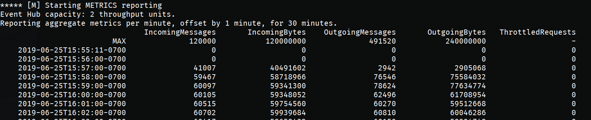

# Streaming at Scale with Azure Event Hubs, Functions and Cosmos DB

This sample uses Cosmos DB as database to store JSON data

The provided scripts will create an end-to-end solution complete with load test client. A detailed discussion on the scenario and the technical details is available here:

[Serverless Streaming At Scale with Cosmos DB](https://medium.com/@mauridb/serverless-streaming-at-scale-with-cosmos-db-e0e26cacd27d)

The sample has been updated from when the article (and also Cosmos DB is constantly improved) was written so the values you'll measure may be a little different than the one documented in the article. Still the concepts explanied are still valid and valuable.

## Running the Scripts

Please note that the scripts have been tested on [Ubuntu 18 LTS](http://releases.ubuntu.com/18.04/), so make sure to use that environment to run the scripts. You can run it using Docker, WSL or a VM:

- [Ubuntu Docker Image](https://hub.docker.com/_/ubuntu/)
- [WSL Ubuntu 18.04 LTS](https://www.microsoft.com/en-us/p/ubuntu-1804-lts/9n9tngvndl3q?activetab=pivot:overviewtab)
- [Ubuntu 18.04 LTS Azure VM](https://azuremarketplace.microsoft.com/en-us/marketplace/apps/Canonical.UbuntuServer1804LTS)

The following tools/languages are also needed:

- [Azure CLI](https://docs.microsoft.com/en-us/cli/azure/install-azure-cli-apt?view=azure-cli-latest)
  - Install: `sudo apt install azure-cli`
- [jq](https://stedolan.github.io/jq/download/)
  - Install: `sudo apt install jq`
- [Zip](https://askubuntu.com/questions/660846/how-to-zip-and-unzip-a-directory-and-its-files-in-linux)
  - Install : `sudo apt install zip`
- [Dotnet Core](https://dotnet.microsoft.com/download/linux-package-manager/ubuntu18-04/sdk-current)

## Setup Solution

Make sure you are logged into your Azure account:

    az login

and also make sure you have the subscription you want to use selected

    az account list

if you want to select a specific subscription use the following command

    az account set --subscription <subscription_name>

once you have selected the subscription you want to use just execute the following command

    ./create-solution.sh -d <solution_name>

then `solution_name` value will be used to create a resource group that will contain all resources created by the script. It will also be used as a prefix for all resource create so, in order to help to avoid name duplicates that will break the script, you may want to generate a name using a unique prefix. **Please also use only lowercase letters and numbers only**, since the `solution_name` is also used to create a storage account, which has several constraints on characters usage:

[Storage Naming Conventions and Limits](https://docs.microsoft.com/en-us/azure/architecture/best-practices/naming-conventions#storage)

to have an overview of all the supported arguments just run

    ./create-solution.sh

**Note**
To make sure that name collisions will be unlikely, you should use a random string to give name to your solution. The following script will generated a 7 random lowercase letter name for you:

    ./_common/generate-solution-name.sh

## Created resources

The script will create the following resources:

- **Azure Container Instances** to host Spark Load Test Clients: by default one client will be created, generating a load of 1000 events/second
- **Event Hubs** Namespace, Hub and Consumer Group: to ingest data incoming from test clients
- **Azure Function**: to process data incoming from Event Hubs as a stream
- **Application Insight**: to monitor Azure Function performances
- **Cosmos DB** Server, Database and Collection: to store and serve processed data

The Azure Function is created using .Net Core 2.1, so it can be compiled on any supported platform. I only tested compilation on Windows 10, though.

## Streamed Data

Streamed data simulates an IoT device sending the following JSON data:

```json
{
    "eventId": "b81d241f-5187-40b0-ab2a-940faf9757c0",
    "complexData": {
        "moreData0": 57.739726013343247,
        "moreData1": 52.230732688620829,
        "moreData2": 57.497518587807189,
        "moreData3": 81.32211656749469,
        "moreData4": 54.412361539409427,
        "moreData5": 75.36416309399911,
        "moreData6": 71.53407865773488,
        "moreData7": 45.34076957651598,
        "moreData8": 51.3068118685458,
        "moreData9": 44.44672606436184,
        [...]
    },
    "value": 49.02278128887753,
    "deviceId": "contoso://device-id-154",
    "deviceSequenceNumber": 0,
    "type": "CO2",
    "createdAt": "2019-05-16T17:16:40.000003Z"
}
```

## Duplicate event handling

As a result of transient errors, events could be processed more than once (at-least-once event delivery guarantee). In case the infrastructure fails and recovers, it could process a second time an event from Event Hubs that has already been stored in Cosmos DB. The solution uses Function binding logic to [upsert into Cosmos DB](https://docs.microsoft.com/en-us/azure/azure-functions/functions-bindings-cosmosdb-v2) to make this operation idempotent, so that events are not duplicated in Cosmos DB (based on the eventId attribute).

In order to illustrate the effect of this, the event simulator is configured to randomly duplicate a small fraction of the messages (0.1% on average). Those duplicates will not be present in Cosmos DB.

## Solution customization

If you want to change some setting of the solution, like number of load test clients, Cosmos DB RU and so on, you can do it right in the `create-solution.sh` script, by changing any of these values:

    export EVENTHUB_PARTITIONS=2
    export EVENTHUB_CAPACITY=2
    export PROC_FUNCTION_SKU=P2v2
    export PROC_FUNCTION_WORKERS=2
    export COSMOSDB_RU=20000
    export SIMULATOR_INSTANCES=1

The above settings have been chosen to sustain a 1,000 msg/s stream. The script also contains settings for 5,000 msg/s and 10,000 msg/s.

## Monitor performance

In order to monitor performance of created solution you just have to open the created Application Insight resource and then open the "Live Metric Streams" and you'll be able to see in the "incoming request" the number of processed request per second. The number you'll see here is very likely to be lower than the number of messages/second sent by test clients since the Azure Function is configured to use batching".

Performance will be monitored and displayed on the console for 30 minutes also. More specifically Inputs and Outputs performance of Event Hub will be monitored. If everything is working correctly, the number of reported `IncomingMessages` and `OutgoingMessages` should be roughly the same. (Give couple of minutes for ramp-up)



## Azure Functions

The deployed Azure Function solution contains two functions

- Test0
- Test1

The first one uses Cosmos DB binding for Azure Function, while the second one uses the SDK. Only one solution will be activated during deployment. By default the activated one is "Test0"

As mentioned in the article [Serverless Streaming At Scale with Cosmos DB](https://medium.com/streaming-at-scale-in-azure/serverless-streaming-at-scale-with-cosmos-db-e0e26cacd27d) with Azure Functions 2.0 there is no performance difference between the two options. Usage of SDK is recommended only when you need to get more information out of Cosmos DB response, for example consumed RU, that you can't get using the native binding.

## Cosmos DB

As you'll notice when using funciont "Test1", Cosmos DB reports something a bit more than 8 RU used for each written document. This is due to the fact that 1Kb document is ingested, but in the sample Azure Functions are used to augment the incoming JSON by adding some additional data, making the document a little bit bigger than 1Kb.

Cosmos DB index policy has been set up in order to index only the meaninful properties to avoid to waste RU in properties that will never be searched for and thus indexing won't help in any way. Keeping the indexing enabled for all properties, would raise the RU usage, per document, to 19 (100% more!). On the other hand, removing indexing from all properties will bring down RU usage to 6.

Both the decision were taken as they reflect common real-world scenarios; but if you want to play with document size, you can chance the setting `COMPLEX_DATA_COUNT` in the `run-clients.sh` script. That values sets how many `moreData` properties will be created in the generated sample document, and therefore how big the document will be. By default 23 `moreData` elements are created, so that the document sent into EventHub is around 1Kb. If you want to make sure that the document sent to Cosmos DB is within the 1 Kb limit, lower the number to 8. If you make this change while solution has been already deployed and running, make sure to deploy the Test client only but running the script with the `-s` option:

    ./create-solution.sh -d <solution_name> -t <test_type> -s T

Having said that, you may be wondering why, for 5K msgs/sec, up to 50K RU are needed or why for 10K msgs/sec up to 100K RU are needed. If you do that math, in fact, for 5K msgs/sec, you can find that 5000 * 8.5 = 42500 RU should be needed for the 5K msgs/sec scenario. If you analyze how many partitions are created behind the scenes (you can do that via the "Metrics" pane in Cosmos DB Azure Portal page) you'll that some partitions are more used than others and they quickly hit the alloted RU capacity. Documents are generated with a random `deviceId` that goes from `001` to `999` using a uniform distribution. Depending on how Cosmos DB decided to group partition keys into physical partitions and how the document are generated, received and processed, one partition (or more than one) can be used more than others. So some room for movement is needed, and thus the need of having a bit more of allocated RU to make sure performance are never throttled.

## Exceptions

Just after starting the Azure Function, if you immediately go to the Application Insight blade on the Azure Portal, you may see the following exception:

    New receiver with higher epoch of '3' is created hence current receiver with epoch '2' is getting disconnected. If you are recreating the receiver, make sure a higher epoch is used.

You can safely ignore it since it happens just during startup time when EventProcessors are created. After couple of seconds the no more exception like that one will be thrown. No messages will be lost while these exceptions are fired.

## Query Data

Data is available in the created Cosmos DB database. You can query it from the portal, for example:

```sql
SELECT * FROM c WHERE c.type = 'CO2'
```

## Clean up

To remove all the created resource, you can just delete the related resource group

```bash
az group delete -n <resource-group-name>
```
