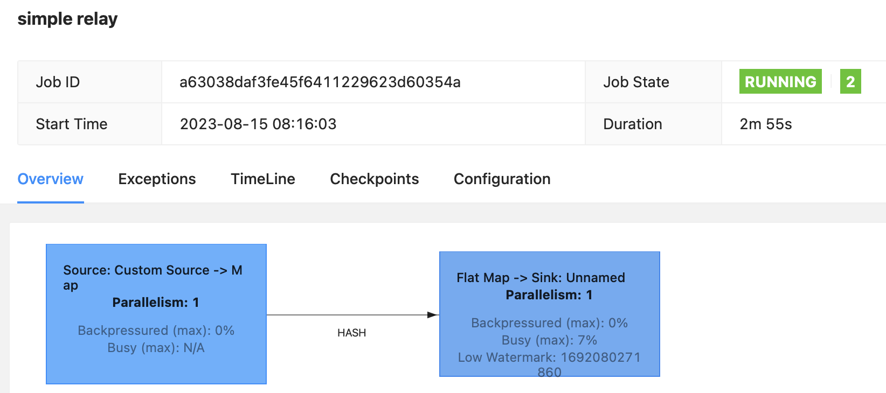

# Streaming at Scale with Azure Event Hubs and Apache Flink

This sample uses Apache Flink to process streaming data from Event Hubs Kafka and uses another Event Hubs Kafka as a sink to store JSON data. This is done to analyze pure streaming performance of Flink; no aggregation is done and data is passed as fast as possible from the input to the output. Data is augmented by adding additional fields.

To support very high throughput, two different Event Hubs namespaces are deployed by the template. Event Hubs capacity is limited to up to 20 units of 1 MB/s each (although this limit can be increased through a support ticket). If incoming throughput is under 10 MB/s, you could deploy two Event Hub instances under a single namespace instead.

The provided scripts will create an end-to-end solution complete with load test client.

## Running the Scripts

Please note that the scripts have been tested on [Ubuntu 18 LTS](http://releases.ubuntu.com/18.04/), so make sure to use that environment to run the scripts. You can run it using Docker, WSL or a VM:

- [Ubuntu Docker Image](https://hub.docker.com/_/ubuntu/)
- [WSL Ubuntu 18.04 LTS](https://www.microsoft.com/en-us/p/ubuntu-1804-lts/9n9tngvndl3q?activetab=pivot:overviewtab)
- [Ubuntu 18.04 LTS Azure VM](https://azuremarketplace.microsoft.com/en-us/marketplace/apps/Canonical.UbuntuServer1804LTS)

The following tools/languages are also needed:

- [Azure CLI](https://docs.microsoft.com/en-us/cli/azure/install-azure-cli-apt?view=azure-cli-latest)
  - Install: `sudo apt install azure-cli`
- [jq](https://stedolan.github.io/jq/)
  - Install: `sudo apt install jq`
- [Maven](https://maven.apache.org/install.html)
  - Install: `sudo apt install maven`
- [Unzip](https://askubuntu.com/questions/660846/how-to-zip-and-unzip-a-directory-and-its-files-in-linux)
  - Install: `sudo apt install unzip`

## Setup Solution

Make sure you are logged into your Azure account:

    az login

and also make sure you have the subscription you want to use selected

    az account list

if you want to select a specific subscription use the following command

    az account set --subscription <subscription_name>

once you have selected the subscription you want to use just execute the following command

    ./create-solution.sh -d <solution_name>

then `solution_name` value will be used to create a resource group that will contain all resources created by the script. It will also be used as a prefix for all resource create so, in order to help to avoid name duplicates that will break the script, you may want to generated a name using a unique prefix. **Please also use only lowercase letters and numbers only**, since the `solution_name` is also used to create a storage account, which has several constraints on characters usage:

[Storage Naming Conventions and Limits](https://docs.microsoft.com/en-us/azure/architecture/best-practices/naming-conventions#storage)

to have an overview of all the supported arguments just run

    ./create-solution.sh

**Note**
To make sure that name collisions will be unlikely, you should use a random string to give name to your solution. The following script will generated a 7 random lowercase letter name for you:

    ./generate-solution-name.sh

## Created resources

The script will create the following resources:

- **Azure Container Instances** to host Load Test Clients: by default one client will be created, generating a load of 1000 events/second
- **Event Hubs** Namespace, Hub and Consumer Group: to ingest data incoming from test clients and to store data generated by Apache Flink
- **HDInsight**: to host the Apache Flink job that processes event data
- **Azure Monitor**: to monitor HDInsight, Azure Kubernetes Service and Flink

## Streamed Data

Streamed data simulates an IoT device sending the following JSON data:

```json
{
    "eventId": "b81d241f-5187-40b0-ab2a-940faf9757c0",
    "complexData": {
        "moreData0": 57.739726013343247,
        "moreData1": 52.230732688620829,
        "moreData2": 57.497518587807189,
        "moreData3": 81.32211656749469,
        "moreData4": 54.412361539409427,
        "moreData5": 75.36416309399911,
        "moreData6": 71.53407865773488,
        "moreData7": 45.34076957651598,
        "moreData8": 51.3068118685458,
        "moreData9": 44.44672606436184,
        [...]
    },
    "value": 49.02278128887753,
    "deviceId": "contoso-device-id-000154",
    "deviceSequenceNumber": 0,
    "type": "CO2",
    "createdAt": "2019-05-16T17:16:40.000003Z"
}
```

## Duplicate event handling

The solution does not perform event deduplication. In order to illustrate the effect of this, the event simulator is configured to randomly duplicate a small fraction of the messages (0.1% on average). Those duplicate events will be present in the destination Event Hub.

## Solution customization

If you want to change some setting of the solution, like number of load test clients, event hubs TU and so on, you can do it right in the `create-solution.sh` script, by changing any of these values:

    export EVENTHUB_CAPACITY=2
    export EVENTHUB_PARTITIONS=1
    export FLINK_PARALLELISM=3
    export SIMULATOR_INSTANCES=1
    export HDINSIGHT_AKS_WORKER_SIZE=Standard_D8ds_v5

The above settings have been chosen to sustain a 1,000 msg/s stream. The script also contains settings for 5,000 msg/s and 10,000 msg/s.

## Monitor performance

The deployment script will report performance, by default every minute for 30 minutes:

```
***** [M] Starting METRICS reporting
Reporting aggregate metrics per minute, offset by 2 minutes, for 30 minutes.
                             Event Hub #    IncomingMessages       IncomingBytes    OutgoingMessages       OutgoingBytes   ThrottledRequests
                             -----------    ----------------       -------------    ----------------       -------------  ------------------
    2023-08-15T08:01:57+0200 Event Hub 1                   0                   0                   0                   0                   0
    2023-08-15T08:01:59+0200 Event Hub 2                   0                   0                   0                   0                   0
    2023-08-15T08:02:02+0200 Event Hub 1                   0                   0                   0                   0                   0
    2023-08-15T08:02:03+0200 Event Hub 2                   0                   0                   0                   0                   0
    2023-08-15T08:03:02+0200 Event Hub 1                   0                   0                   0                   0                   0
    2023-08-15T08:03:03+0200 Event Hub 2                   0                   0                   0                   0                   0
    2023-08-15T08:04:02+0200 Event Hub 1                   0                   0                   0                   0                   0
    2023-08-15T08:04:04+0200 Event Hub 2                   0                   0                   0                   0                   0
    2023-08-15T08:05:09+0200 Event Hub 1                   0                   0                   0                   0                   0
    2023-08-15T08:05:11+0200 Event Hub 2                   0                   0                   0                   0                   0
    2023-08-15T08:06:03+0200 Event Hub 1               23821            20565185                   0                   0                   0
    2023-08-15T08:06:04+0200 Event Hub 2                   0                   0                   0                   0                   0
    2023-08-15T08:07:03+0200 Event Hub 1               60088            51900051                   0                   0                   0
    2023-08-15T08:07:05+0200 Event Hub 2                   0                   0                   0                   0                   0
    2023-08-15T08:08:02+0200 Event Hub 1               60013            51874051                   0                   0                   0
    2023-08-15T08:08:04+0200 Event Hub 2                   0                   0                   0                   0                   0
    2023-08-15T08:09:02+0200 Event Hub 1               60083            51952748                   0                   0                   0
    2023-08-15T08:09:04+0200 Event Hub 2                   0                   0                   0                   0                   0
    2023-08-15T08:10:04+0200 Event Hub 1               60113            51976704                   0                   0                   0
    2023-08-15T08:10:05+0200 Event Hub 2                   0                   0                   0                   0                   0
    2023-08-15T08:11:02+0200 Event Hub 1               60122            51991471                   0                   0                   0
    2023-08-15T08:11:04+0200 Event Hub 2                   0                   0                   0                   0                   0
    2023-08-15T08:12:02+0200 Event Hub 1               59964            51849376                   0                   0                   0
    2023-08-15T08:12:04+0200 Event Hub 2                   0                   0                   0                   0                   0

```

In column "Event Hub #", 1 refers to the Event Hub used as input to
Flink, and 2 to the Event Hub used as output. After a few minutes of
ramp-up, the metrics for Event Hub 1 will show around 60k events/min
(depending on selected event rate, here 1k events/s). As Apache Flink
starts, the incoming message rate on Event Hub 2 rate will also reach
around 60k events/min.

## Apache Flink

The deployed Apache Flink solution doesn't do any analytics or projection, but only populates two fields in the JSON message: the time at which the event was received in Event Hubs, and the current timestamp.

The Flink Job Manager UI shows information about the current running job. The Job Manager UI is accessible from the Azure Portal.



## Query Data

Data is available in the created Event Hub output. You can use the Process Data screen in the Azure portal to inspect the event data.

## Clean up

To remove all the created resource, you can just delete the related resource group:

```bash
az group delete -n <resource-group-name>
```
