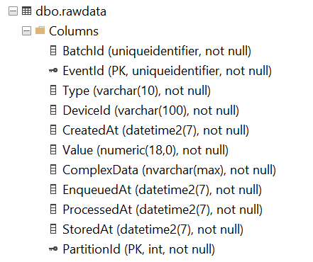

# Streaming at Scale with Azure HDInsight Kafka, Databricks and Azure SQL Data Warehouse

This sample uses Azure SQL Data Warehouse as database to store JSON data.

The provided scripts will create an end-to-end solution complete with load test client.

## Running the Scripts

Please note that the scripts have been tested on [Ubuntu 18 LTS](http://releases.ubuntu.com/18.04/), so make sure to use that environment to run the scripts. You can run it using Docker, WSL or a VM:

- [Ubuntu Docker Image](https://hub.docker.com/_/ubuntu/)
- [WSL Ubuntu 18.04 LTS](https://www.microsoft.com/en-us/p/ubuntu-1804-lts/9n9tngvndl3q?activetab=pivot:overviewtab)
- [Ubuntu 18.04 LTS Azure VM](https://azuremarketplace.microsoft.com/en-us/marketplace/apps/Canonical.UbuntuServer1804LTS)

The following tools/languages are also needed:

- [Azure CLI](https://docs.microsoft.com/en-us/cli/azure/install-azure-cli-apt?view=azure-cli-latest)
  - Install: `sudo apt install azure-cli`
- [jq](https://stedolan.github.io/jq/download/)
  - Install: `sudo apt install jq`
- [python]
  - Install: `sudo apt install python python-pip`
- [databricks-cli](https://github.com/databricks/databricks-cli)
  - Install: `pip install --upgrade databricks-cli`

## Setup Solution

Make sure you are logged into your Azure account:

    az login

and also make sure you have the subscription you want to use selected

    az account list

if you want to select a specific subscription use the following command

    az account set --subscription <subscription_name>

once you have selected the subscription you want to use just execute the following command

    ./create-solution.sh -d <solution_name>

then `solution_name` value will be used to create a resource group that will contain all resources created by the script. It will also be used as a prefix for all resource create so, in order to help to avoid name duplicates that will break the script, you may want to generate a name using a unique prefix. **Please also use only lowercase letters and numbers only**, since the `solution_name` is also used to create a storage account, which has several constraints on characters usage:

[Storage Naming Conventions and Limits](https://docs.microsoft.com/en-us/azure/architecture/best-practices/naming-conventions#storage)

to have an overview of all the supported arguments just run

    ./create-solution.sh

**Note**
To make sure that name collisions will be unlikely, you should use a random string to give name to your solution. The following script will generated a 7 random lowercase letter name for you:

    ./_common/generate-solution-name.sh

## Created resources

The script will create the following resources:

- **Azure Container Instances** to host Spark Load Test Clients: by default one client will be created, generating a load of 1000 events/second
- **HDInsight Kafka** cluster: to ingest data incoming from test clients. A topic will be automatically created
- **Azure Databricks**: to process data incoming from HDInsight Kafka as a stream. Workspace, Job and related cluster will be created
- **Azure SQL Data Warehouse** Server and Database instance: to store and serve processed data

## Streamed Data

Streamed data simulates an IoT device sending the following JSON data:

```json
{
    "eventId": "b81d241f-5187-40b0-ab2a-940faf9757c0",
    "complexData": {
        "moreData0": 57.739726013343247,
        "moreData1": 52.230732688620829,
        "moreData2": 57.497518587807189,
        "moreData3": 81.32211656749469,
        "moreData4": 54.412361539409427,
        "moreData5": 75.36416309399911,
        "moreData6": 71.53407865773488,
        "moreData7": 45.34076957651598,
        "moreData8": 51.3068118685458,
        "moreData9": 44.44672606436184,
        [...]
    },
    "value": 49.02278128887753,
    "deviceId": "contoso-device-id-000154",
    "deviceSequenceNumber": 0,
    "type": "CO2",
    "createdAt": "2019-05-16T17:16:40.000003Z"
}
```

## Duplicate event handling

The Azure Databricks connector for Azure SQL Data Warehouse offers [end-to-end exactly-once guarantee for writing data in streaming mode](https://docs.azuredatabricks.net/spark/latest/data-sources/azure/sql-data-warehouse.html#fault-tolerance-semantics). This is automatically handled by the connector. This guarantees exactly-once delivery between Databricks and SQL DW, but will not resolve duplicate events arising from at-least-once delivery guarantees upstream of Event Hubs. In order to illustrate the effect of this, the event simulator is configured to randomly duplicate a small fraction of the messages (0.1% on average). Those duplicates are propagated up to SQL DW.

## Solution customization

If you want to change some setting of the solution, like number of load test clients, Azure SQL Data Warehouse tier and so on, you can do it right in the `create-solution.sh` script, by changing any of these values:

```bash
    export HDINSIGHT_KAFKA_WORKERS="4"  
    export HDINSIGHT_KAFKA_WORKER_SIZE="Standard_D3_V2"  
    export KAFKA_PARTITIONS=4
    export SQL_SKU=DW100c
    export SIMULATOR_INSTANCES=1 
    export DATABRICKS_NODETYPE=Standard_DS3_v2
    export DATABRICKS_WORKERS=4
    export DATABRICKS_MAXEVENTSPERTRIGGER=10000
```

The above settings have been chosen to sustain a 1,000 msg/s stream. The script also contains settings for 5,000 msg/s and 10,000 msg/s.

## Monitor performance

Performance will be monitored and displayed on the console for 30 minutes also. More specifically Inputs and Outputs performance of Event Hub will be monitored. If everything is working correctly, the number of reported `IncomingMessages` and `OutgoingMessages` should be roughly the same. (Give couple of minutes for ramp-up)


## Azure HDInsight Kafka

An [HDInsight Kafka](https://docs.microsoft.com/en-us/azure/hdinsight/kafka/apache-kafka-introduction) cluster is deployed with 4 workers into a Virtual Network. For maximum availability, [choose a region containing three fault domains](https://docs.microsoft.com/en-us/azure/hdinsight/kafka/apache-kafka-get-started).

The Load Test Clients are deployed into Azure Container Instances into the HDInsight Virtual Network. [ACI doesn't support internal DNS resolution](https://docs.microsoft.com/en-us/azure/container-instances/container-instances-vnet#unsupported-networking-scenarios), thus Kafka must be configured to advertise IP addresses rather than host names](https://docs.microsoft.com/en-us/azure/hdinsight/kafka/apache-kafka-connect-vpn-gateway#configure-kafka-for-ip-advertising), and to listen to all IP addresses. The solution creation scripts automatically apply the necessary configuration using the Ambari REST API.

## Azure SQL Data Warehouse

The SQL Data Warehouse is deployed by default at the lowest Gen2 tier ([DW100c](https://docs.microsoft.com/en-us/azure/sql-data-warehouse/memory-and-concurrency-limits)) which is sufficient for the ingestion scenario alone, but only offers very limited resources and supports up to 4 parallel queries. In a production scenario, a higher tier should usually be used.

The solution allows you to test both row-store and column-store options. The deployed database contains two tables:

- `rawdata`
- `rawdata_cs`

The suffix indicates which kind of storage is used for the table:

- No suffix: classic row-store table
- `cs`: column-store via clustered columnstore index

Use the `-k` option and set it to `rowstore` or `columnstore`.

If you want to connect to Azure SQL Data Warehouse to query data and/or check resources usages, here's the login and password:

```
User ID = serveradmin
Password = Strong_Passw0rd!
```

## Azure Databricks

Azure Databricks is deployed into a Virtual Network that is [peered](https://docs.azuredatabricks.net/administration-guide/cloud-configurations/azure/vnet-peering.html#virtual-network-peering) to the HDInsight virtual network.

The [Azure Databricks SQL Data Warehouse connector](https://docs.azuredatabricks.net/spark/latest/data-sources/azure/sql-data-warehouse.html) is used to stream data into SQL DW. This is optimally implemented through parallel writes and read in a temporary storage account (Polybase connector).

One interesting aspect to notice is that the number of EventHubs partition is different and higher that the number of allocated Throughput Units (TU). For example, with 5000 msgs/sec 6 TU are used, but 10 partitions are needed. The 6 TU are more than enough to sustain 5000 msgs/sec (as each 1 TU supports 1 Mb and 1000 msgs/sec), but in order to process data fast enough, Databricks needs to have 10 workers to be able to deal with the incoming messages. In order to make sure each worker reads from a partition without interfering with another worker, a worker should be created for each Event Hub partition.

## Query Data

All tables have the following schema:



## Clean up

To remove all the created resource, you can just delete the related resource group

```bash
az group delete -n <resource-group-name>
```
