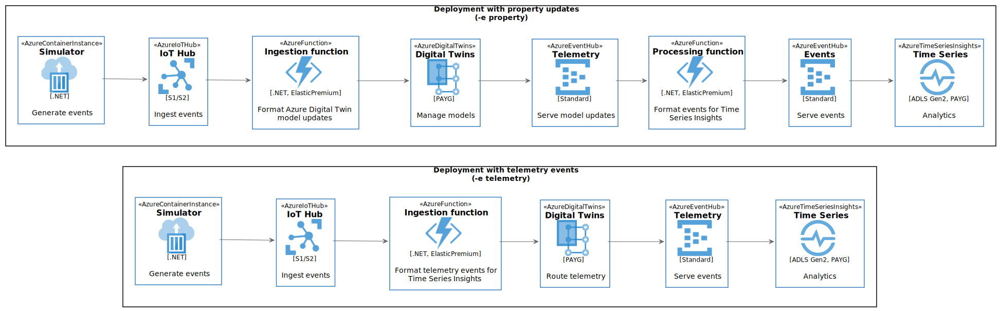

# Streaming at Scale with Azure IoT Hubs, Azure Digital Twins and Azure Time Series Insights

This sample uses Azure Digital Twins to manage device model information,
and Azure Time Series Insights as database to store JSON data.
Time Series Insights ingests event data from Event Hubs and makes it available
for online querying and exploration. In addition, it stores the data in Parquet
format on Azure Storage, where it is available for analytics.




The provided scripts will create an end-to-end solution complete with load test client.

## Running the Scripts

Please note that the scripts have been tested on [Ubuntu 18 LTS](http://releases.ubuntu.com/18.04/), so make sure to use that environment to run the scripts. You can run it using Docker, WSL, Mac OS or a VM:

- [Ubuntu Docker Image](https://hub.docker.com/_/ubuntu/)
- [WSL Ubuntu 18.04 LTS](https://www.microsoft.com/en-us/p/ubuntu-1804-lts/9n9tngvndl3q?activetab=pivot:overviewtab)
- [Ubuntu 18.04 LTS Azure VM](https://azuremarketplace.microsoft.com/en-us/marketplace/apps/Canonical.UbuntuServer1804LTS)

The following tools/languages are also needed:

- [Azure CLI](https://docs.microsoft.com/en-us/cli/azure/install-azure-cli-apt?view=azure-cli-latest)
  - Install: `sudo apt install azure-cli`
- [jq](https://stedolan.github.io/jq/download/)
  - Install: `sudo apt install jq`
- [Dotnet Core](https://dotnet.microsoft.com/download/linux-package-manager/ubuntu18-04/sdk-current)
- [Terraform](https://www.terraform.io/downloads.html)

## Setup Solution

Make sure you are logged into your Azure account:

    az login

and also make sure you have the subscription you want to use selected

    az account list

if you want to select a specific subscription use the following command

    az account set --subscription <subscription_name>

once you have selected the subscription you want to use just execute the following command

    ./create-solution.sh -d <solution_name>

then `solution_name` value will be used to create a resource group that will contain all resources created by the script. It will also be used as a prefix for all resource create so, in order to help to avoid name duplicates that will break the script, you may want to generate a name using a unique prefix. **Please also use only lowercase letters and numbers only**, since the `solution_name` is also used to create a storage account, which has several constraints on characters usage:

[Storage Naming Conventions and Limits](https://docs.microsoft.com/en-us/azure/architecture/best-practices/naming-conventions#storage)

to have an overview of all the supported arguments just run

    ./create-solution.sh

**Note**
To make sure that name collisions will be unlikely, you should use a random string to give name to your solution. The following script will generated a 7 random lowercase letter name for you:

    ../_common/generate-solution-name.sh

## Created resources

The script will create the following resources:

- **Azure Container Instances** to host [Load Test Clients](https://github.com/Azure-Samples/Iot-Telemetry-Simulator): by default one client will be created, generating a load of 50 events/second (in total) across 1000 simulated devices
- **Azure IoT Hub**: to ingest data incoming from test clients
- **Azure Function** (first instance): to process events from IoT Hub and stream them into Azure Digital Twins
- **Azure Digital Twins**: to manage a model of each simulated device
- **Event Hubs** (first instance) Namespace, Hub and Consumer Group: to ingest stream of updates from Azure Digital Twins
- **Azure Function** (second instance): to process and transform Azure Digital Twins update events from Event Hubs and stream them into Time Series Insights (through Event Hubs)
- **Event Hubs** (second instance) Namespace, Hub and Consumer Group: to ingest data into Time Series Insights
- **Azure Time Series Insights**: to process data incoming from Event Hubs as a stream, and store and serve processed data. Environment and dat a source will be created

## Streamed Data

Streamed data simulates an IoT device sending the following JSON data:

```json
{
    "eventId": "b81d241f-5187-40b0-ab2a-940faf9757c0",
    "complexData": {
        "moreData0": 0.57739726013343247,
        "moreData1": 0.52230732688620829,
        "moreData2": 0.57497518587807189,
        "moreData3": 0.8132211656749469,
        "moreData4": 0.54412361539409427,
        "moreData5": 0.7536416309399911,
        "moreData6": 0.7153407865773488,
        "moreData7": 0.4534076957651598,
        "moreData8": 0.513068118685458,
        "moreData9": 0.4444672606436184,
        [...]
    },
    "value": 0.4902278128887753,
    "deviceId": "contoso-device-id-154",
    "deviceSequenceNumber": 0,
    "type": "CO2",
    "createdAt": "2019-05-16T17:16:40.000003Z"
}
```

## Models

The solution populates models in each layer of the solution to define the simulated devices identity and properties:

- **Azure IoT Hub**: to manage device identities, and accept telemetry events from the simulator
- **Azure Digital Twins**: to manage a [semantic model](models/digital_twin_types.json) in [DTDL format](https://docs.microsoft.com/en-us/azure/digital-twins/overview) of each simulated device and its properties
- **Azure Time Series Insights**: to define a model of [types](models/time_series_insights_types.json) and [hierarchies](models/time_series_insights_hierarchies.json) in a [Time Series Model](https://docs.microsoft.com/en-us/azure/time-series-insights/concepts-model-overview) to drive the Time Series Insights UX.

## Monitor performance

Performance will be monitored and displayed on the console for 30 minutes. More specifically Inputs and Outputs performance of Event Hub will be monitored. If everything is working correctly, the number of reported `IncomingMessages` and `OutgoingMessages` should be roughly the same (following a few minutes of ramp-up)

```
***** [M] Starting METRICS reporting
Event Hub #1 Namespace: evh-name
Event Hub capacity: 1 throughput units (this determines MAX VALUE below).
Reporting aggregate metrics per minute, offset by 2 minutes, for 30 minutes.
                             Event Hub #    IncomingMessages       IncomingBytes    OutgoingMessages       OutgoingBytes   ThrottledRequests
                             -----------    ----------------       -------------    ----------------       -------------  ------------------
                   MAX VALUE Event Hub 1               60000            60000000              245760           120000000                   -
                             -----------    ----------------       -------------    ----------------       -------------  ------------------
Event Hub #2 Namespace: evh-name
Event Hub capacity: 1 throughput units (this determines MAX VALUE below).
Reporting aggregate metrics per minute, offset by 2 minutes, for 30 minutes.
                             Event Hub #    IncomingMessages       IncomingBytes    OutgoingMessages       OutgoingBytes   ThrottledRequests
                             -----------    ----------------       -------------    ----------------       -------------  ------------------
                   MAX VALUE Event Hub 2               60000            60000000              245760           120000000                   -
                             -----------    ----------------       -------------    ----------------       -------------  ------------------
    2021-01-03T07:32:38+0100 IoT Hub                       0                                                                                
    2021-01-03T07:32:40+0100 Event Hub 1                   0                   0                   0                   0                   0
    2021-01-03T07:32:43+0100 Event Hub 2                   0                   0                   0                   0                   0
    2021-01-03T07:33:04+0100 IoT Hub                       0                                                                                
    2021-01-03T07:33:06+0100 Event Hub 1                   0                   0                   0                   0                   0
    2021-01-03T07:33:08+0100 Event Hub 2                   0                   0                   0                   0                   0
    2021-01-03T07:34:03+0100 IoT Hub                       0                                                                                
    2021-01-03T07:34:05+0100 Event Hub 1                   0                   0                   0                   0                   0
    2021-01-03T07:34:09+0100 Event Hub 2                   0                   0                   0                   0                   0
    2021-01-03T07:35:02+0100 IoT Hub                       0                                                                                
    2021-01-03T07:35:04+0100 Event Hub 1                   0                   0                   0                   0                   0
    2021-01-03T07:35:06+0100 Event Hub 2                   0                   0                   0                   0                   0
    2021-01-03T07:36:02+0100 IoT Hub                    3000                                                                                
    2021-01-03T07:36:05+0100 Event Hub 1                 301              390589                 301              390589                   0
    2021-01-03T07:36:07+0100 Event Hub 2                 722              565568                 722              565568                   0
    2021-01-03T07:37:02+0100 IoT Hub                    3000                                                                                
    2021-01-03T07:37:04+0100 Event Hub 1                2826             3667217                2826             3667217                   0
    2021-01-03T07:37:06+0100 Event Hub 2                2895             2268888                2895             2268888                   0
    2021-01-03T07:38:02+0100 IoT Hub                    3000                                                                                
    2021-01-03T07:38:04+0100 Event Hub 1                2854             3703536                2854             3703536                   0
    2021-01-03T07:38:06+0100 Event Hub 2                2977             2333291                2977             2333291                   0
    2021-01-03T07:39:02+0100 IoT Hub                    3000                                                                                
    2021-01-03T07:39:04+0100 Event Hub 1                3100             4022626                3100             4022626                   0
    2021-01-03T07:39:06+0100 Event Hub 2                2880             2256762                2880             2256762                   0
    2021-01-03T07:40:02+0100 IoT Hub                    3000                                                                                
    2021-01-03T07:40:04+0100 Event Hub 1                2939             3816059                2939             3816059                   0
    2021-01-03T07:40:05+0100 Event Hub 2                3072             2409879                3072             2409879                   0
```

## Azure Digital Twins

The solution allows you to test [Property updates or Telemetry events](https://docs.microsoft.com/en-us/azure/digital-twins/concepts-models#properties-vs-telemetry).

Use the `-e` option and set it to `property` or `telemetry` to run the solution in the mode you are interested in testing.

With Property updates, an additional Event Hubs instance and Azure Function are deployed to transform the Azure Digital Twin property update event stream into TSI events.

## Azure Time Series Insights

Time Series Insights (TSI) is configured to ingest data from Event Hubs. TSI automatically parses the JSON fields into Parquet columns.

## Browse Data

Data is available in the created Azure Time Series Insights environment. You can browse it from the portal.


## Verification

To automatically verify that the solution is performing as expected, wait for the metrics output to stabilize for a few minutes, then exit the script (Ctrl-C) and rerun it with the `-s V` option:

    ./create-solution.sh -d <solution_name> -s V

This provisions a Databricks Workspace and runs a notebook that reads the event data collected in Time Series Insights.

The notebook computes aggregated statistics per minute and asserts that, at least for one minute of data ingestion:
* 90% of the requested event rate has been achieved (to account for fluctuations).
* There is less than a small amount of duplicate events, if any.

If the run is successful and the output is empty, that means that all assertions were verified. Otherwise, failed assertions are displayed. You can click on the notebook link in the console output to view the run details.

## Clean up

To remove all the created resource, you can just delete the related resource group

```bash
az group delete -n <resource-group-name>
```
